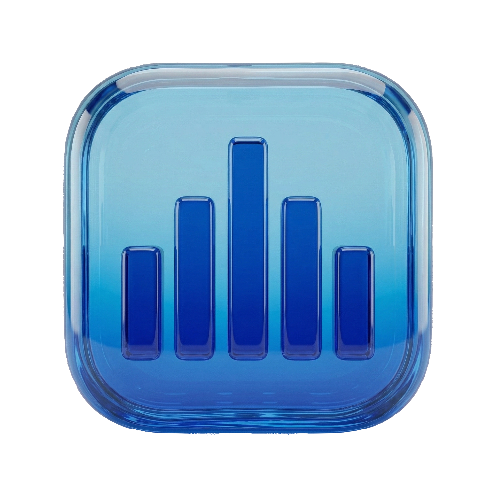

<div align="center">



# Spotti

**A native macOS Spotify client.**

SwiftUI on top, Rust underneath.

</div>

---

<div align="center">


</div>

## What it is

Spotti plays your Spotify library through a native Mac app. No Electron, no web wrapper. The UI is SwiftUI; the playback core is Rust built on [librespot](https://github.com/librespot-org/librespot) and [rspotify](https://github.com/ramsayleung/rspotify), bridged over a C FFI.

Requires a Spotify Premium account.

## Features

- Full Spotify Connect (Spirc) — control and visibility across devices
- Library, playlists, albums, artists, search, recommendations
- Now Playing integration with media keys and Control Center
- Mini player and menu bar controls
- Smart Mix personalized playlist
- Glass-style interface tuned for macOS 26

## Install

Grab the signed and notarized DMG from [Releases](https://github.com/stefanfaur/spotti/releases).

## Build from source

Requires Xcode 26, Rust (stable), and `uv`.

```sh
scripts/build-rust.sh      # build the Rust core
scripts/build-dmg.sh       # build, sign, and package a DMG
```

Or open `SpottiApp/Spotti/Spotti.xcodeproj` and run.

## Stack

| Layer      | Tech                                         |
| ---------- | -------------------------------------------- |
| UI         | SwiftUI, iOS 26 Liquid Glass                 |
| Core       | Rust, Tokio                                  |
| Playback   | librespot (Spirc, rodio backend)             |
| Web API    | rspotify                                     |
| Media keys | souvlaki                                     |
| Bridge     | cbindgen-generated C FFI                     |

## License

See repository for license details.
